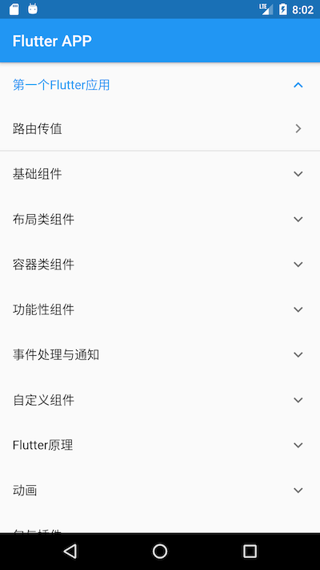

# 《Flutter实战》随书源码

本项目为[《Flutter实战》电子书](https://github.com/flutterchina/flutter-in-action)随书源码，本书实体书名待定。

## 说明

1. 示例文件列表可以参照main.dart。
2. 并不是《Flutter实战》所有示例都有源码。如有必要，欢迎读者补充其它示例（提PR）.
3. ”实例篇“源码位于 "github_client_app"子目录下，需要用IDE单独打开

## 运行效果

## 打赏

对我有帮助？请作者喝杯咖啡

